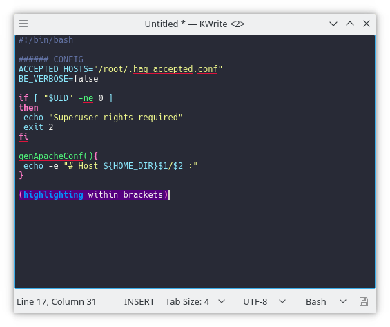

# Dracula for [Kate](https://kate-editor.org/)

> A dark theme for [Kate](https://kate-editor.org/) (and any katepart application, such as [KWrite](https://www.kde.org/applications/utilities/kwrite/), [Kile](http://kile.sourceforge.net/), and [KDevelop](https://www.kdevelop.org/)).

## Install

All instructions can be found at [draculatheme.com/kate](https://draculatheme.com/kate).

## Team

This theme is maintained by the following person(s) and a bunch of [awesome contributors](https://github.com/dracula/template/graphs/contributors).

|  |
| ------------------------------------------------------------------------------------------------------ |
| [nortexoid](https://github.com/nortexoid)                                                              |

## Community

- [Twitter](https://twitter.com/draculatheme) - Best for getting updates about themes and new stuff.
- [GitHub](https://github.com/dracula/dracula-theme/discussions) - Best for asking questions and discussing issues.
- [Discord](https://draculatheme.com/discord-invite) - Best for hanging out with the community.

## License

[MIT License](./LICENSE)
